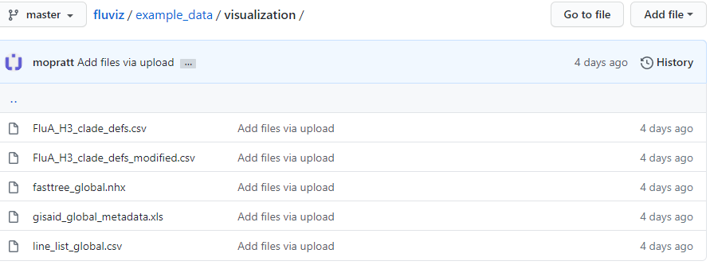
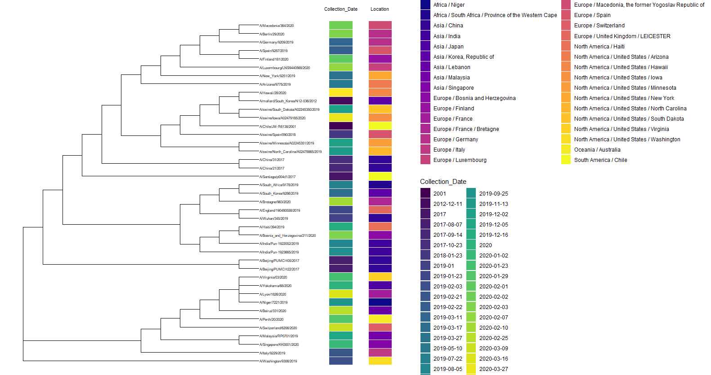
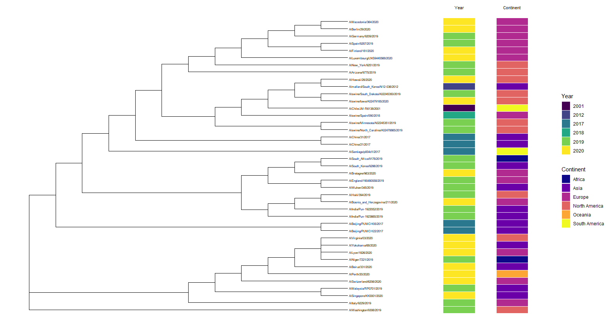

#### Welcome to the [Shiny app](https://shiny.rstudio.com/) for fluviz, a visualization tool for influenza sequence data. fluviz is built using R, and the source code as well as example data can be found on [GitHub](https://github.com/mopratt/fluviz). You can navigate this Shiny app by selecting tools from the navigation tabs at the top of the page. These tools are intended to be used alongside the [Influenza Classification Suite](https://github.com/Public-Health-Bioinformatics/flu_classification_suite), which characterizes flu sequences *(see below)*.  
  
# Table of Contents
* [Influenza Classification Suite](#influenza-classification-suite)  
* [Requirements](#requirements)  
* [Usage](#usage)  
* [Packages](#packages)  
* [Tutorial for RStudio](#tutorial)  
* [References](#references)
  
### **Example Visualizations:**  
Metadata heatmap:  
  
Antigenic AA SNP plot:  

  
  
### **Influenza Classification Suite**  
The **Influenza Classification Suite** assigns clades to influenza protein sequences and extracts antigenic sites, which are then mapped to a reference sequence. The ouput of the classification workflow is a line list containing an antigenic site alignment and associated metadata:  

  
*Image from: [Eisler et al., (2020). Influenza Classification Suite: An automated Galaxy workflow for rapid influenza sequence analysis](https://doi.org/10.1111/irv.12722)*

The R functions available here allow Influenza Classification Suite users to generate visualizations of influenza clades and associated metadata, as well as interactive visualizations of the line list output. A tutorial is provided in R Markdown format in the **docs/** folder, and the individual R functions are available under **rcode/**.  
If you would like to run the entire workflow on Galaxy before running the visualization, example data for the Classification Suite is available in **example_data/classification_suite/** or in the [Flu Suite GitHub repository](https://github.com/Public-Health-Bioinformatics/flu_classification_suite/tree/master/tools) for each individual tool. Example data for completing the fluviz tutorial on its own is available in **example_data/visualization/**.  
  
### Requirements  
fluviz functions can be run in any environment that supports **R** and/or **RStudio**. RStudio is recommended for code editing and for viewing the tutorial. The fluviz functions were built under R version 4.0.2 *"Taking off Again"* and RStudio version 1.3.959. In order to successfully use these functions, the user must supply inputs from [**GISAID**](https://www.gisaid.org/) and from the **Influenza Classification Suite**
  
### Usage  
To follow the R Markdown tutorial, download the latest versions of R and RStudio to your computer. Download the .Rmd file in the **/docs** folder and open it in RStudio or, copy/paste the text into a new .Rmd file. You may be required to install new packages (below). Next, click on "Knit" to generate the tutorial document and associated images in markdown. If you are not able to access RStudio, the tutorial is also available below. Follow along with the test data or with your own data by loading the functions and copying the code in the tutorial.   
  

  
### Packages  
fluviz is built in R. It uses the following main packages: **tidyverse**, **ggplot2**, **treeio**, **ggtree**, **ggnewscale**, and **plotly**. To read more about these and about the Influenza Classification Suite please see [References](#references) below:  
  
### Tutorial  
##### To visualize the output of the Classification Suite you can use this Shiny app on its own. However, if you would like to see "behind the scenes" and customize your visualizations further in RStudio, only 3 R functions are needed *(you will also need to install and load the packages listed above)*:    
1. **combine_metadata()**  
2. **metamap()** *and*  
3. **snpplot()**  
  
  The source code for these R functions is available in the **rcode** folder on GitHub. If you want to follow this tutorial in RStudio, download the R scripts for each function, open and run them in RStudio, then download the example data and follow along:  
  
  
*R scripts containing the functions are available in the rcode folder*  
  
*Example data is available for you to download and follow along with or without running the Flu Suite*

#### Combining metadata from GISAID and Line List output:  
The **combine_metadata()** function takes as input:  
1. the path to a metadata file (in .xls format) from GISAID  
2. the path to a line list file (in .csv format) from the Influenza Classification Suite  
3. the name of the column in the GISAID metadata that corresponds to the sequence labels.  
(*Note: this is likely going to be either "Isolate_Name" or "Isolate_Id"*)  
  
The output is a .csv file which is saved to your working directory. This .csv file can then be imported as a dataframe and further manipulated in R using common [**dplyr**](https://github.com/tidyverse/dplyr) verbs such as **mutate()** and **summarise()** in order to make the data more suitable for visualization. Another free tool for data cleaning is [Open Refine](https://openrefine.org/).  
  
```r
library(tidyverse) 
# loading tidyverse will load core packages including dplyr and readr, though you can also load these separately.
library(readxl)

combine_metadata(metadata = "example_data/visualization/gisaid_global_metadata.xls",
                 line_list = "example_data/visualization/line_list_global.csv",
                 label_col = "Isolate_Name",
                 filename = "combined_metadata.csv")

# read the data back into your environment as a dataframe:
metadata <- read_csv("combined_metadata.csv") 

# optional steps: now is a good time to clean up the metadata to make the visualization easier to read.  
# An example of this using dplyr:
metadata_clean <- metadata %>% 
  mutate(Year = substr(Collection_Date, 1, 4)) %>%
  separate(col = Location, c("Continent", "Country", "Region"), sep = "/")
```  
#### Reading in a phylogenetic tree file as a tree object using **treeio**  
You can use your preferred program for generating a phylogenetic tree. The example tree here was generated using FastTree in Galaxy. Depending on the type of extension your tree file is saved as, remove the *"#"* from the appropriate line of code below and insert the path to your tree file:  
*If your tree extension is not listed below, see [Chapter 1: Importing Tree with Data](http://yulab-smu.top/treedata-book/chapter1.html) from Data Integration, Manipulation and Visualization of Phylogenetic Trees by Guangchuang Yu, PhD, the author of ggtree.*
```r  
library(treeio)
library(ggtree)
#tree <- read.newick(path/to/tree.nwk)
#tree <- read.nexus(path/to/tree.nexus)
tree <- read.nhx("example_data/visualization/fasttree_global.nhx")
```  
  
#### Generate a cladogram of sequences and metadata heatmap:  
The **metamap()** function takes as input:  
1. a tree object, imported to R using **treeio** *(above)*    
2. a dataframe of metadata containing columns you would like to visualize in the heatmap  
3. a list of column names that will be visualized next to the cladogram. These columns can be categorical or numerical variables. 
The output is a cladogram of sequences (without branch length scaling) and a heatmap of the specified metadata.   
  
```r
library(ggplot2)
library(ggnewscale)

# Specify which columns to display using the "cols =" argument:
metamap(tree, metadata, cols = c("Clade", "Host", "Percent.id")) 

# You can alslo modify the theme of the plot, including the legend, by adding theme() elements onto the metamap() call:  
# metamap(tree, metadata, cols = c("Clade", "Host", "Percent.id")) + theme(legend.position = "left")
```  
  
  
If we try mapping other columns, the need for metadata cleaning becomes clear:  
```r
# original metadata:  
metamap(tree, metadata, cols = c("Collection_Date", "Location")) + theme(legend.position = "right")
# using metadata_clean: 
metamap(tree, metadata_clean, cols = c("Year", "Continent")) + theme(legend.position = "right")
```
  
*Too many categorical variables are difficult to tell apart using the colour scale and inconsistent formatting of collection dates makes this visualization uninformative.*  
  
  
*Aggregating the collection dates into years only and the locations into continents makes for a visualization that is much easier to read at a glance.*  
  
##### *Your visualization is only as good as your metadata!*
  
#### Generate an interactive SNP plot based on the line list output:  
The **snpplot()** function takes as input:  
1. a tree object  
2. the path to a line list file (in .csv format) from the Influenza Classification Suite   
3. a dataframe of the sequence metadata  
4. the path to a clade definition file (in .csv format) that was used as input to the Influenza Classification Suite.  
  
The output is an interactive SNP plot of antigenic amino acids that differ from the reference sequence (provided to the Classification Suite). The amino acids are coloured according to whether they match the clade definition file. The tooltip information is specified within the **snpplot()** function, and can be easily modified.   
  
```r
library(plotly)
snpplot(tree, line_list = "example_data/visualization/line_list_global.csv",
        metadata, clade_def = "example_data/visualization/FluA_H3_clade_defs.csv")
```
  
  
*This is a static image, however, when viewed in RStudio or exported to HTML, this plot is interactive including hover tooltips and selection/zoom options*
  
Now you should be able to generate plots using the fluviz functions **combine_metadata()**, **metamap()**, and **snpplot()**.

#### Happy Visualizing!
  
### References    
**R:** R Core Team (2019). R: A language and environment for statistical computing. R Foundation for Statistical Computing, Vienna, Austria. URL https://www.R-project.org/.  
**RStudio:** RStudio Team (2020). RStudio: Integrated Development for R. RStudio, PBC, Boston, MA URL http://www.rstudio.com/.  
**Shiny:** Winston Chang, Joe Cheng, JJ Allaire, Yihui Xie and Jonathan McPherson
  (2020). shiny: Web Application Framework for R. R package version 1.5.0.
  https://CRAN.R-project.org/package=shiny  
**Flu Classification Suite:** Eisler D, Fornika D, Tindale LC, Chan T, Sabaiduc S, Hickman R, et al (2020). Influenza Classification Suite: An automated Galaxy workflow for rapid influenza sequence analysis. Influenza Other Respir Viruses. May;14(3):358–62.  
**GISAID:** Shu, Y., McCauley, J. (2017)  GISAID: Global initiative on sharing all influenza data – from vision to reality. EuroSurveillance, 22(13) DOI:10.2807/1560-7917.ES.2017.22.13.30494  PMCID: PMC5388101  
**tidyverse:** Wickham et al., (2019). Welcome to the tidyverse. Journal of Open Source Software, 4(43), 1686, https://doi.org/10.21105/joss.01686  
**ggplot2:** H. Wickham. (2016). ggplot2: Elegant Graphics for Data Analysis. Springer-Verlag New York.  
**treeio:** LG Wang, TTY Lam, S Xu, Z Dai, L Zhou, T Feng, P Guo, CW Dunn, BR Jones, T Bradley, H Zhu, Y Guan, Y Jiang, G Yu (2020). treeio: an R package for phylogenetic tree input and output with richly annotated and associated data. Molecular Biology and Evolution. 37(2):599-603. doi: 10.1093/molbev/msz240  
**ggtree:** G Yu, D Smith, H Zhu, Y Guan, TTY Lam. (2017). ggtree: an R package for visualization and annotation of phylogenetic trees with their covariates and other associated data. Methods in Ecology and Evolution. 8(1):28-36. doi:10.1111/2041-210X.12628  
**ggnewscale:** Elio Campitelli (2020). ggnewscale: Multiple Fill and Colour Scales in 'ggplot2'. R package version 0.4.3.https://CRAN.R-project.org/package=ggnewscale  
**plotly:**  C. Sievert. (2020). Interactive Web-Based Data Visualization with R, plotly, and shiny. Chapman and Hall/CRC Florida.
