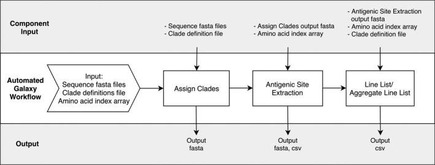

## Introduction to fluviz
FluViz is a visualization tool for the [Influenza Classification Suite](https://doi-org.ezproxy.cscscience.ca/10.1111/irv.12722), which rapidly analyzes influenza virus sequences including clade mapping and antigenic site extraction. Example data for this tutorial including sequences from [GISAID](https://www.gisaid.org/) is available on [GitHub](https://github.com/mopratt/fluviz/tree/master/example_data/visualization)   
**Prior to visualizing your own data with FluViz, please use the Classification Suite workflow on Galaxy  to analyze and classify your influenza sequences.**  
  
**Influenza Classification Suite Workflow:**
  
    
##### To visualize the output of the Classification Suite, only 3 R functions are needed:  
1. **combine_metadata()**  
2. **metamap()** *and*  
3. **snpplot()**  
  
The source code for these R functions is available in the **rcode** folder from the GitHub page. If you want to follow this tutorial in RStudio, download the RScripts for each function, open and run them in RStudio, then download the example data and follow along:
    
### Combining metadata from GISAID and Line List output:  
The **combine_metadata()** function takes as input:  
1. the path to a metadata file (in .xls format) from GISAID  
2. the path to a line list file (in .csv format) from the Influenza Classification Suite  
3. the name of the column in the GISAID metadata that corresponds to the sequence labels.  
(*Note: this is likely going to be either "Isolate_Name" or "Isolate_Id"*)  
The output is a .csv file which is saved to your working directory. This .csv file can then be imported as a dataframe and further manipulated in R using common [**dplyr**](https://github.com/tidyverse/dplyr) verbs such as **mutate()** and **summarise()** in order to make the data more suitable for visualization. Another free tool for data cleaning is [Open Refine](https://openrefine.org/).  

```r
combine_metadata(metadata = "example_data/visualization/gisaid_global_metadata.xls",
                 line_list = "example_data/visualization/line_list_global.csv",
                 label_col = "Isolate_Name",
                 filename = "combined_metadata.csv")

metadata <- read_csv("combined_metadata.csv")
# Optional steps: now is a good time to clean up the metadata and add any additional columns you would like to visualize. 
# Example:
metadata_clean <- metadata %>% 
  mutate(Year = substr(Collection_Date, 1, 4)) %>%
  separate(col = Location, c("Continent", "Country", "Region"), sep = "/")
```
### Reading in a phylogenetic tree file as a tree object using **treeio**  
Depending on the type of extension your tree file is saved as, remove the *"#"* from the appropriate line of code below and insert the path to your tree file:  
*If your tree extension is not listed below, see [Chapter 1: Importing Tree with Data](http://yulab-smu.top/treedata-book/chapter1.html) from Data Integration, Manipulation and Visualization of Phylogenetic Trees by Guangchuang Yu, PhD, the author of ggtree.*

```r
library(treeio)
library(ggtree)
#tree <- read.newick(path/to/tree.nwk)
#tree <- read.nexus(path/to/tree.nexus)
tree <- read.nhx("example_data/visualization/fasttree_global.nhx")
```
  
### Generate a cladogram of sequences and metadata heatmap:  
The **metamap()** function takes as input:  
1. a tree object, imported to R using **treeio** *(above)*    
2. a dataframe of metadata containing columns you would like to visualize in the heatmap  
3. a list of column names that will be visualized next to the cladogram. These columns can be categorical or numerical variables. 
The output is a cladogram of sequences (without branch length scaling) and a heatmap of the specified metadata. 

```r
metamap(tree, metadata, cols = c("Clade", "Host", "Percent.id")) 
# specify columns from the metadata to be mapped
```
*Note: you can modify plot elements including the theme and legend placement by adding theme elements to replace the current theme, for example:*

```r
metamap(tree, metadata, cols = c("Clade", "Host", "Percent.id")) + theme(legend.position = "left") 
# change the placement of the legend from the bottom of the plot to the left side of the plot
```
Now try mapping other columns, with and without data cleaning steps:

```r
metamap(tree, metadata, cols = c("Collection_Date", "Location")) + theme(legend.position = "right")
metamap(tree, metadata_clean, cols = c("Year", "Continent")) + theme(legend.position = "right")
```
   
### Generate an interactive SNP plot based on the line list output: 
The **snpplot()** function takes as input:  
1. a tree object  
2. the path to a line list file (in .csv format) from the Influenza Classification Suite   
3. a dataframe of the sequence metadata  
4. the path to a clade definition file (in .csv format) that was used as input to the Influenza Classification Suite.  
  
The output is an interactive SNP plot of antigenic amino acids that differ from the reference sequence (provided to the Classification Suite). The amino acids are coloured according to whether they match the clade definition file. The tooltip information is specified within the **snpplot()** function, and can be easily modified.   

```r
snpplot(tree, line_list = "example_data/visualization/line_list_global.csv",
        metadata, clade_def = "example_data/visualization/FluA_H3_clade_defs.csv")
```
Now you should be able to generate plots using the fluviz functions **combine_metadata()**, **metamap()**, and **snpplot()**.

## Happy Visualizing!
